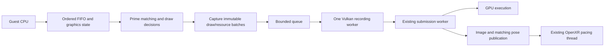

# Quest renderer threading proposal

Status: design only, 2026-09-13. No additional renderer worker is implemented by
the descriptor-cache change. This proposal preserves Prime's rendering rules,
visibility and the detached OpenXR pacing fixes.

## Why consider another worker?

In the saved heavy-area scene, the video thread consumes approximately one CPU
core while simulation runs around 64% speed. Descriptor reuse saves work, but
does not bring the total frame cost down to the 16.7 ms required for 60 Hz
emulation. See [the measurements](Quest-Descriptor-Hash-Performance.md).

The 25-second post-cache profile sampled about 24.66 CPU seconds on the video
thread. Across the application it sampled 37.50 CPU seconds: roughly 1.50 cores
on average. The emulated CPU thread accounted for approximately 0.45 of a core,
and OpenXR pacing approximately 0.026. These are sampled execution totals, not
a guarantee that another core is continuously free or that work can overlap.
GPU time, memory bandwidth, clock changes and scheduling can still limit gains.

Two ceilings bound what a backend worker can return, both taken from the same post-cache
artifacts (`steady-video.txt` and `cache-live.csv`):

1. **Movable work is about 28% of the video thread.** `VKGfx::DrawIndexed` (16.2%, which
   contains the 8.4% descriptor-set update), `VertexManager::UploadUniforms` (8.9%),
   `CommitBuffer` (1.3%) and presentation (1.6%) are the only rows that the ownership table
   below assigns to the worker. At roughly 26 ms per emulated frame that is about 7 ms;
   perfect overlap leaves about 19 ms on the producer, near 53 FPS, before the packet copies
   the interface needs. Texture validation, vertex loading, FIFO decode and Prime matching all
   stay on the producer.
2. **The GPU was already 79–84% busy at 599 MHz while rendering 38 FPS** (kgsl `gpubusy`
   in the live counter CSV). The same scene at 60 FPS needs about 125%. The worker only pays
   off once GPU cost per frame drops, for example by rendering at 2x native resolution
   instead of 3x, and the headroom check should be repeated at whichever scale is chosen.

The cheap producer-side reductions that do not need a thread are recorded in
[Quest-Video-Thread-Overhead.md](Quest-Video-Thread-Overhead.md); measure those first so the
worker is judged against the remaining cost.

Parallelism already exists:

| Existing thread/workers | Responsibility |
| --- | --- |
| Emulation CPU | Execute guest code and produce GPU commands |
| Video | Decode FIFO, update graphics state, resolve textures, apply Prime overrides, record Vulkan commands |
| Vulkan submission | Submit completed command buffers; run the XR finalization callback |
| OpenXR pacing | `xrWaitFrame`/`xrBeginFrame`/`xrEndFrame` and publication of the latest completed content |
| Shader workers | Compile pipelines asynchronously when the selected compilation mode permits it |

The remaining video work is not a collection of independent draws. BP writes
flush preceding draws; later operations depend on earlier texture copies and
register changes. Prime's flag registration, occurrence counters, draw ranges,
layer classification and thermal-copy selection also have ordering effects.

## First candidate: one ordered backend worker

Start with one producer and one consumer. Keep FIFO interpretation and Prime
decisions on the existing video thread. Give a new worker exclusive ownership
of backend recording state. Move immutable batches between them through a
bounded queue. Existing submission and pacing threads retain their roles.

The intended overlap is preparation of a later batch while the worker records
an earlier one. Dispatching a task and immediately waiting for each draw, hash
or descriptor update would add synchronization without useful overlap.

This split is an architectural change. `VKGfx` calls currently access shared
singletons and some return results immediately. A queue added only around
`DrawIndexed` would leave dependencies on live state and would move relatively
little work. First establish a command/packet interface with a synchronous
consumer; then move that same consumer to a worker.

## Ownership and packet contents

| State/resource | Owner and rule |
| --- | --- |
| BP/XF registers, FIFO decode state | Producer; consumer never reads live `bpmem`/`xfmem` |
| Prime classifiers, flags and counters | Producer, updated in original draw order |
| Draw decisions | Capture skip/handling, layer, depth, units-per-meter and texture-layer overrides after classification |
| Shader state | Capture UID/host-config identity and immutable constants; retain pipeline/shader lifetime |
| Vertex/index data | Batch-owned storage or immutable retained allocation; no pointers into a stream buffer the producer can overwrite |
| Textures and samplers | Stable handles plus retained lifetime and content version; resource creation/update/destruction are ordered commands |
| Vulkan `StateTracker`, command buffers and descriptor pools | Backend worker only; submission worker retains its existing queue role |
| Uniform/vertex upload rings | Backend owns reservation and retirement; producer data remains alive until consumed |
| Frame pose, eye views/FOV and XFB identity | Immutable frame/presentation token carried to the matching publication |
| UI/configuration changes | Snapshot per batch or apply as explicit ordered changes, never read partially changed live settings |

A proposed batch header needs a monotonically increasing sequence, an emulation
generation, and a frame token. Draw/resource commands refer to owned payloads
or immutable versioned objects. Config, constants and unchanged data can share
immutable blocks; copying every complete state object per draw would create
substantial bandwidth and allocation overhead at roughly 2,500 draws per frame.

Resource identity alone is insufficient. A texture object can keep the same
Vulkan image view while its contents are updated. A queued draw must observe
the contents that were valid at that point in the emulated command stream.
Likewise, a raw guest-memory pointer is not an immutable input snapshot.

Resource factories will need logical metadata/IDs that can be returned to the
producer before backend creation completes, or an explicit synchronous creation
reply. Do not expose a partially initialized mutable Vulkan object to both
threads. Creation failure must propagate through a defined error/drain path.

## Synchronization requirements

| Event | Required behavior |
| --- | --- |
| Ordinary draw/state change | Commit in original FIFO order. Batching must not move a draw across a state or resource change |
| FIFO distance, CP tokens/draw-done and CPU-to-video async requests | Preserve existing guest-visible ordering. Do not acknowledge work earlier merely because a batch was queued; service requests against their required backend sequence |
| Texture upload or palette/TMEM change | Copy/retain input before the producer can mutate it; install the result before dependent draws |
| EFB copy used by a later draw | Record copy and dependent resource version in order; preserve Prime thermal-source selection |
| EFB/XFB copy to guest RAM | Complete the necessary readback before exposing RAM to guest operations that require it; a recorded command is not a completed copy |
| EFB peek, bounding-box/performance query, or other synchronous result | Flush the preceding batch, wait for the required recording/GPU completion, and return through a reply token |
| Command-buffer rollover | Backend ends the pass/submits in order, updates recording state, and retires the right resources |
| Descriptor-pool reuse | Wait for every GPU use of that pool epoch, then reset it and invalidate cached descriptor sets |
| Texture/sampler destruction | Retain through queued CPU use and submitted GPU use; invalidate descriptor lookups before the handle can be recycled |
| Pipeline-cache/config/backend reset | Drain work using old objects and publish a new configuration/resource generation |
| Pause/stop/game switch | Stop producing, settle queued work, and leave no callback accessing destroyed core/backend state |
| Save state | Establish an ordered checkpoint; complete required deferred copies/readbacks before serializing coherent state |
| Load/undo-load state | Quiesce old work before applying restored state; invalidate old packets/resources/poses by generation, then restart with empty queues and caches |
| OpenXR session loss or swapchain recreation | Drain/cancel affected presentation work, retire image uses, invalidate old frame tokens, and restart with the new swapchain generation |

Keep **recording completion** and **GPU completion** as separate milestones.
Consuming a packet only means its commands were recorded; it does not allow
reuse of upload memory or destruction of objects still referenced by the GPU.
The existing fence counters and deferred-destruction rules remain authoritative
for GPU lifetime. Add a separate consumed-sequence acknowledgement for payloads
that are needed only while recording.

Audit `SyncGPU`, FIFO distance accounting and `AsyncRequests` alongside the
backend queue. Advancing the producer can let the emulated CPU reuse memory or
command-buffer storage sooner. Capture all required FIFO/display-list/indexed
vertex/texture inputs before releasing their current lifetime guarantees;
use an ordered drain wherever the existing guest-visible behavior requires a
result rather than merely captured input.

Save/load requires more than emptying the queue. The backend may already have
submitted work, and the submit worker may still own an XR finalization callback.
Before restoring memory, settle or safely discard all old-generation callbacks
and any work that could write guest RAM. Then reset FIFO-derived state, texture
and descriptor caches, replay state and frame-pose associations. Do not allow an
old callback to publish a pre-load image after the restored frame is active.

## Prime-specific ordering that must remain

`VertexManagerBase::Flush` builds runtime signatures and classifies draws before
applying overrides. `ElementsGroupManager` increments stable occurrence counters
once per draw sequence and tracks previous/current-frame flag and range state.
Those mutations remain on the producer. A worker may compute a pure signature
from captured inputs later, but its result must be committed at the correct
sequence position.

The thermal-source window is explicitly armed for the **next** matching EFB
copy. Moving classification after copy recording, or sorting draws by pipeline
or texture, can change the selected thermal source. HUD, visor, gun, cinematic
and menu treatments must be captured as resolved decisions and constants.

Vertex conversion also has hidden dependencies: array bases and cached
position/normal/tangent/binormal values are shared today. Parallel conversion
requires a per-job loader context plus ordered publication of the caches used
by later draws. It is not safe to call the current loader concurrently.

## OpenXR image/pose pairing and latency

Preserve the current contract between XFB pose stamping, selected presentation
pose, eye blit, queue submission, image release and layer publication. The
pacing thread can repeat the latest completed frame while emulation is slow.
The proposed backend worker must not take over `xrWaitFrame`/`xrEndFrame`.

In particular:

- Capture the exact views/FOV and content identity for each queued frame. Do not
  look up the latest pose by XFB address at delayed presentation time: the same
  address may already have been stamped by a newer frame. Use a retained version
  or an immutable pose token.
- Keep the effective `ScopedVideoFrameHandoff` protection through eye blitting
  and submission/publication as required by the existing implementation. Do not
  release an image while its matching pose publication can be overtaken.
- Preserve multiview's pending-finalization wait and successful swapchain-image
  wait before writing. Preserve direct-to-HMD's single frame-resource advance.
- Bound queued work and frame age. Throughput gained by adding extra old frames
  in front of the headset can worsen head-motion response despite higher FPS.
- Session/swapchain/frame generations must prevent delayed completion of an old
  batch from being accepted by a new session or loaded save state.

A first prototype should batch within a frame and keep at most one unconsumed
frame boundary. Exact batch/byte limits are tuning parameters, but memory and
queue age must be bounded from the first implementation. Backpressure blocks
the producer safely; it must not make the pacing thread wait for new emulation.

## Locking and scheduling rules

Use one explicit owner for mutable backend recording state. Do not make the
singleton safe by adding a global mutex around every Vulkan call; that would
serialize the same work with extra contention.

Publish complete batches with release/acquire semantics. Replies and completion
tokens must have a defined owner, lifetime and generation. Queue capacity waits
must release locks needed by the consumer. Never wait for the backend while
holding Prime matching locks, texture-cache mutation locks, or the Vulkan queue
mutex. The consumer must not synchronously ask the producer to service a callback
while the producer is waiting for that consumer; post completion events instead.

Retain the queue mutex around operations that require Vulkan queue external
synchronization, including the existing OpenXR interactions. Avoid extending its
scope over decoding, packet construction, condition-variable waits or CPU copies.
Record a lock-order table during implementation and reject new reverse call paths.

Affinity needs measurement on the actual headset. Current Android code assigns
the emulated CPU to the highest detected fast core, video to the next, and both
light VR helpers to the third. Source comments identify Quest 3 fast cores as
`{2,3,4,5}` and a narrower runtime RendererWorker cpuset of `{3,4,5}`. These are
not portable guarantees. Inspect effective masks, scheduling and clocks first.

A new thread can inherit the creating thread's single-core affinity, producing
no parallelism until its mask is changed. Do not reuse the VRSubmit role for a
heavy worker: it currently shares a core with pacing. Prefer a permitted spare
fast core for pure preparation work; check whether OpenXR thread registration
changes its allowed mask. Retain a safe fallback if affinity or registration is
rejected, and measure pacing under sustained load rather than relying on the
requested affinity alone.

## Staged implementation and acceptance checks

1. **Capture the interface without adding a thread.** Introduce immutable batch
   commands and a synchronous consumer. Keep a runtime fallback to the original
   path. Compare draw/resource ordering, Prime decisions, content and frame poses.
   Measure packet bytes, copies and allocation cost.
2. **Move that consumer to one worker.** Give it backend ownership, bounded
   buffering, reply/drain tokens and generation handling. Begin with a narrow
   supported Vulkan path and fall back at unsupported synchronous operations;
   fallback must drain and transfer ownership, not mix concurrent direct calls.
3. **Validate transitions before tuning throughput.** Repeated load/undo-load,
   pause/resume, game stop/start, swapchain recreation, title-to-gameplay and
   render-target/EFB transitions must work without stale resources or poses.
4. **Measure saved-scene performance.** Compare CPU time per emulated frame,
   producer/consumer overlap and waits, queue occupancy/age, packet bandwidth,
   GPU timing, frame-fence waits, FPS/VPS and emulation speed. Use the same saved
   state, settings, comparable clocks and stable viewpoint; separate shader warmup.
5. **Only then consider more workers.** Coarse texture decode/validation batches
   need owned source bytes and private scratch buffers; vertex conversion needs
   per-job context. Multiple Vulkan recorders would additionally need independent
   command/descriptor pools and a secondary-command-buffer/render-pass design.

Required correctness checks include forced queue backpressure, delayed worker
completion, stale-generation reply rejection, destruction with queued uses,
and exact draw-order decisions for flags/ranges/thermal copies. Rendering checks
cover stereo head movement, visor/HUD/weapon, off-original-FOV visibility,
scan/thermal effects, menus/cinematics, texture replacement and EFB dependencies.

Do not accept a prototype solely because average FPS rises. It must reduce
measured CPU cost or critical-path time enough to exceed capture noise, keep
bounded memory and latency, and preserve head-motion smoothness. If waits,
snapshots or driver/GPU limits consume the benefit, retain the synchronous path
and report that result. This design is a candidate for testing, not a promised
route to 60 FPS on this scene.

## Code starting points

- `Source/Core/VideoCommon/Fifo.cpp`: `RunGpuLoop`, async CPU-to-video events.
- `Source/Core/VideoCommon/BPStructs.cpp`: ordered register writes/copies and XFB stamping.
- `Source/Core/VideoCommon/VertexManagerBase.cpp`: `Flush`, Prime decisions, uniforms and draw submission.
- `Source/Core/VideoCommon/ElementsGroupManager.cpp`: matching, counters and per-frame state.
- `Source/Core/VideoCommon/TextureCacheBase.cpp`: live RAM/TMEM validation, shared decode scratch, deferred EFB copies and state restore.
- `Source/Core/VideoCommon/VertexLoaderManager.cpp`: shared conversion state/caches.
- `Source/Core/VideoBackends/Vulkan/StateTracker.cpp`: mutable recording state and descriptor cache.
- `Source/Core/VideoBackends/Vulkan/CommandBufferManager.cpp`: submission worker, frame pools, fence counters and deferred destruction.
- `Source/Core/VideoBackends/Vulkan/VulkanOpenXR.cpp`: image waits, submission and finalization callback.
- `Source/Core/VideoCommon/Present.cpp`: source selection and image/pose handoff.
- `Source/Core/VideoCommon/VR/OpenXRManager.cpp`: pose associations, frame publication and pacing ownership.
- `Source/Core/Common/Thread.cpp`: Android core selection and affinity roles.
- `Source/Android/jni/Input/HotkeyDispatcher.cpp`: host-locked state load/save requests.
